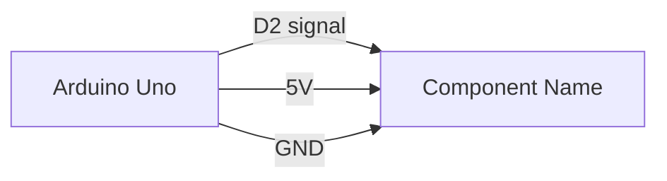

# Make Schema

You are helping document an Arduino electronics or robotics project.

Read these files first:

- `Activity.md`
- `docs/connections.md`
- `arduino/RobTemplate/RobTemplate.ino`

Create or update the Mermaid wiring schema in `docs/connections.md`.

Requirements:

- Use Mermaid markdown fenced blocks.
- Include Arduino board pins, power rails, ground, sensors, actuators, and modules.
- Keep labels short and readable.
- Add a pin assignment table if one is missing.
- Preserve existing project notes unless they are clearly outdated.
- If a connection is uncertain, add it under a `Questions / Assumptions` section instead of guessing silently.

Preferred Mermaid format:

