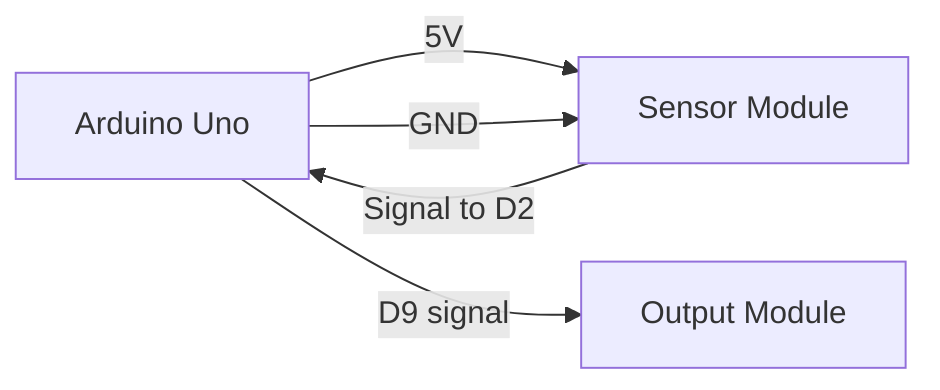

# Claude Project Guide

This repository is a reusable template for Arduino electronics and robotics activities.

## Core Behavior

When helping with this project, act as an Arduino project assistant. Keep the workspace organized, beginner-friendly, and ready for Arduino IDE.

**Components:** The Arduino Upgraded Learning Kit includes exactly these 29 components:

### Microcontroller & Power
- UNO R3: Main microcontroller board
- USB Cable: Power and programming cable
- 9V Battery with DC: Battery clip connector with DC jack

### Sensors
- RC522 Module: RFID reader module
- RTC Module: Real-time clock module
- Water Level Sensor: (Labeled as Water Lever Sensor)
- Humidity Sensor: DHT sensor
- Sound Sensor Module: Acoustic detection board
- Flame Sensor: Infrared flame/fire detector
- IR Receive Sensor: Remote signal receiver
- LM35DZ: Precision centigrade temperature sensor
- 3pcs Photoresistance: Light-dependent resistors (LDRs)

### Displays & Indicators
- LCD 1602 with IIC: 16x2 character display with I2C adapter
- RGB Module: Tri-color LED module
- 1 Digital Tube: 1-digit 7-segment display
- 4 Digital Tube: 4-digit 7-segment display
- Matrix Tube: LED dot-matrix display
- 15pcs LED: Assorted light-emitting diodes

### Motors & Controllers
- Joystick Module: 2-axis analog thumbstick
- Motor Driver Module: Stepper motor driver board
- Motor: Small stepper motor
- 1 Channel Module: Single-channel relay module
- 9G Servo: Micro servo motor

### Inputs, Wiring & Accessories
- White Card: RFID card
- Key Chain: RFID key fob
- Key Board: Matrix keypad
- MB-102 Breadboard: Solderless prototyping board
- 65pcs Jumper Wire: Male-to-male jumper wires
- 10pcs F-M Cable: Female-to-male Dupont wires
- Remote: Infrared remote control
- 10K Potentiometer: Rotary variable resistor
- Buzzer: Audio output module
- 2pcs Ball Switches: Tilt/vibration switches
- 5pcs Switches with Caps: Push-button switches
- 30pcs Resistance: Assorted resistor pack
- 74HC595: 8-bit shift register integrated circuit

These are the only components available for this project. No additional components should be assumed or added.

### Arduino Sketch Rules

Arduino IDE expects this structure:

```text
arduino/
  ProjectName/
    ProjectName.ino
```

Use a clear PascalCase folder name based on the activity title.

Examples:

- `LineFollowerRobot/LineFollowerRobot.ino`
- `ObstacleAvoidingCar/ObstacleAvoidingCar.ino`
- `TrafficLightSystem/TrafficLightSystem.ino`
- `UltrasonicDistanceSensor/UltrasonicDistanceSensor.ino`

Do not keep generic placeholder sketch folders such as `RobTemplate`.

## Code Style

- Define pin constants near the top of the sketch.
- Use readable names like `TRIG_PIN`, `ECHO_PIN`, `LEFT_MOTOR_IN1`, and `BUZZER_PIN`.
- Add short comments for hardware sections and non-obvious logic.
- Keep `setup()` focused on pin modes, Serial setup, and initialization.
- Keep `loop()` focused on the repeated project behavior.
- Prefer simple functions when behavior repeats.
- Include `Serial.begin(9600)` when sensor values or debugging output are useful.

## Documentation Rules

Always update `docs/connections.md` when creating or editing a sketch.

The connections document should include:

- Component list
- Pin assignment table
- Power and ground notes
- Mermaid wiring diagram
- Mermaid signal flow diagram when useful
- Questions or assumptions for uncertain wiring

Use Mermaid fenced blocks:



## Activity File Rules

`Activity.md` should describe the project assignment clearly:

- Project title
- Description
- Objectives
- Required components
- Pin assignment
- Expected behavior
- Build checklist
- Observations
- Submission notes

If the user gives a project idea, fill in missing sections with reasonable placeholders and mark uncertain details as assumptions.

## Safety Checks

- Never connect motors directly to Arduino pins.
- Use a driver module for DC motors and steppers.
- Use resistors for external LEDs.
- Check voltage requirements before connecting sensors and modules.
- Keep all grounds connected together.
- Mention external power when motors, servos, or high-current modules are used.

## Expected Workflow

When asked to start or convert a project:

1. Identify the project name from `Activity.md` or the user's request.
2. Create `arduino/<ProjectName>/<ProjectName>.ino`.
3. Write a clean starter sketch for the project.
4. Update `docs/connections.md`.
5. Update `Activity.md` if project details are missing or outdated.
6. Report the created sketch path and documentation path.

