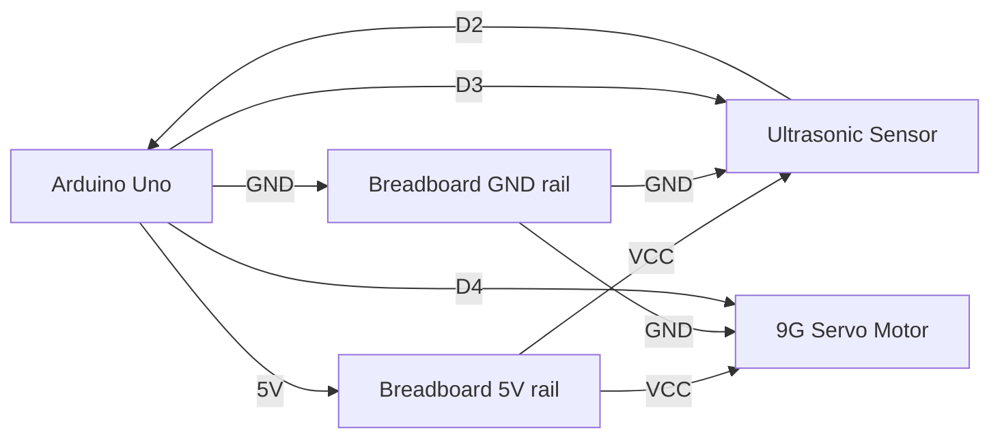
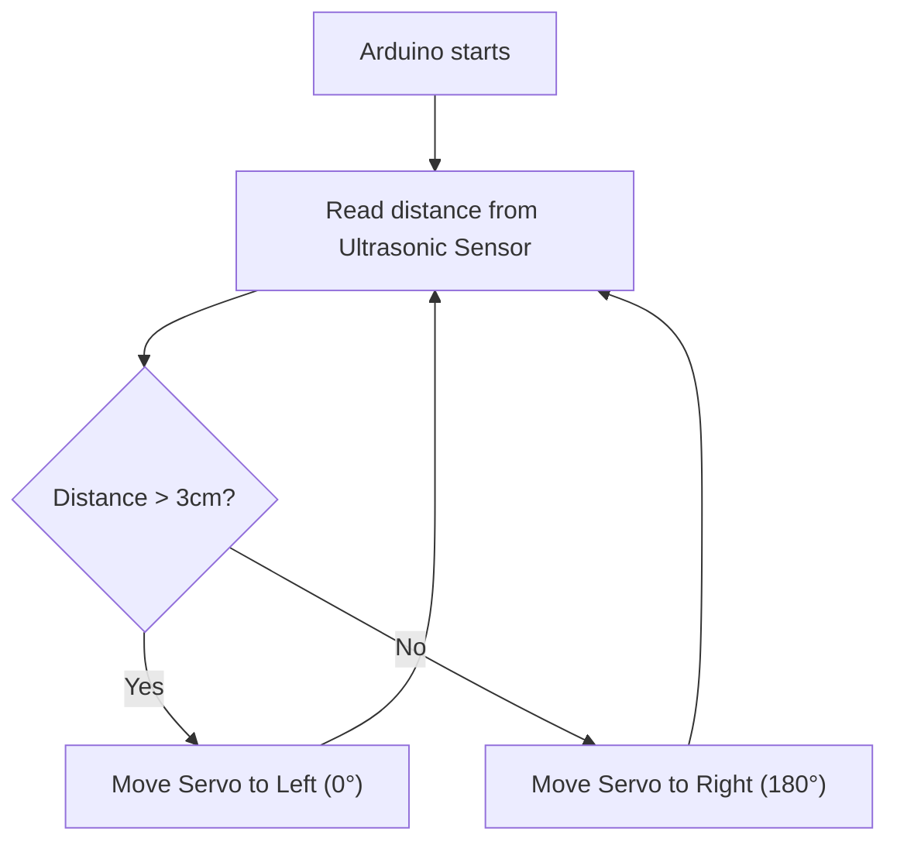

# Electronics Connections

Wiring guide for the Ultrasonic Sensor and Servo Motor Prototype activity.

## Components

| Component | Pin / Terminal | Connected To | Notes |
| --- | --- | --- | --- |
| Arduino Uno | GND | Breadboard negative rail | Common ground |
| Arduino Uno | 5V | Breadboard positive rail | Logic power |
| Ultrasonic Sensor | VCC | Breadboard positive rail | 5V power |
| Ultrasonic Sensor | GND | Breadboard negative rail | Ground |
| Ultrasonic Sensor | TRIG | Arduino D3 | Trigger pulse |
| Ultrasonic Sensor | ECHO | Arduino D2 | Echo pulse |
| Servo Motor | VCC (Red) | Breadboard positive rail | 5V power |
| Servo Motor | GND (Brown/Black) | Breadboard negative rail | Ground |
| Servo Motor | Signal (Orange/Yellow) | Arduino D4 | Position control |

## Pin Assignment

| Arduino Pin | Component Pin | Purpose |
| --- | --- | --- |
| D2 | Ultrasonic ECHO | Read reflected pulse |
| D3 | Ultrasonic TRIG | Trigger ultrasonic pulse |
| D4 | Servo Signal | Control servo position |
| 5V | Component VCCs | Sensor and Servo power |
| GND | Common Ground | Common ground |

## Mermaid Wiring Diagram

## Signal Flow

## Notes

- Keep all grounds connected together.
- For a single 9G servo, the Arduino's 5V pin is usually sufficient, but if the servo twitches or resets the Arduino, external power may be needed.
- Update this file whenever wiring changes.
