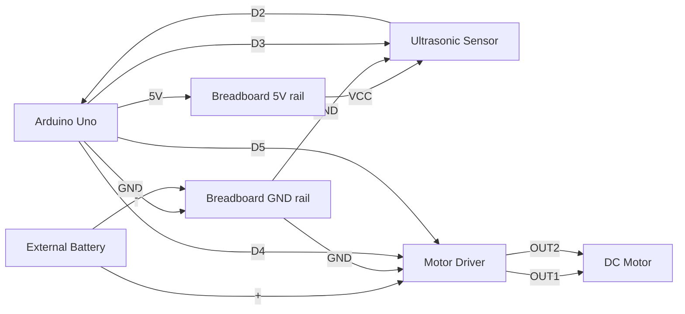
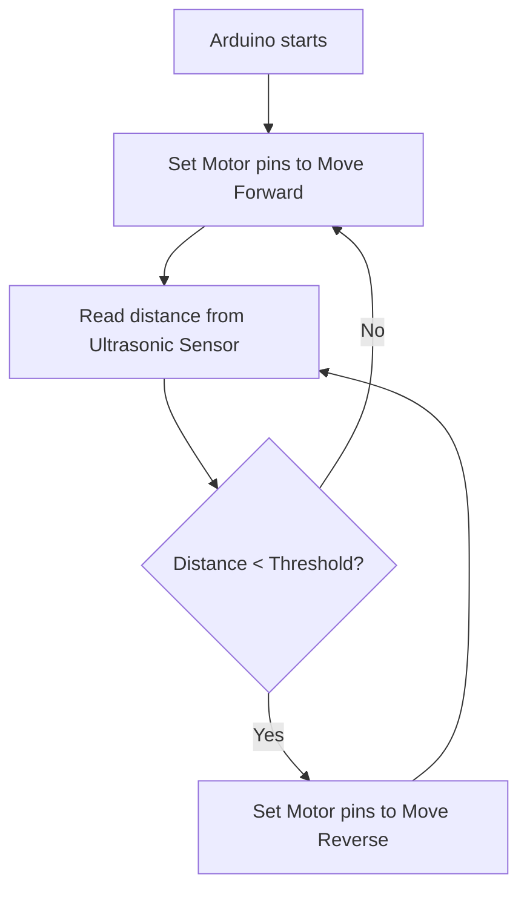

# Electronics Connections

Wiring guide for the Ultrasonic Sensor and Motor Vehicle Prototype activity.

## Components

| Component | Pin / Terminal | Connected To | Notes |
| --- | --- | --- | --- |
| Arduino Uno | GND | Breadboard negative rail | Common ground |
| Arduino Uno | 5V | Breadboard positive rail | Logic power |
| Ultrasonic Sensor | VCC | Breadboard positive rail | 5V power |
| Ultrasonic Sensor | GND | Breadboard negative rail | Ground |
| Ultrasonic Sensor | TRIG | Arduino D3 | Trigger pulse |
| Ultrasonic Sensor | ECHO | Arduino D2 | Echo pulse |
| Motor Driver | VCC / 12V | External Battery Positive (+) | Motor power |
| Motor Driver | GND | Breadboard negative rail | Common ground |
| Motor Driver | IN1 | Arduino D4 | Direction control 1 |
| Motor Driver | IN2 | Arduino D5 | Direction control 2 |
| Motor Driver | OUT1 | Motor Terminal 1 | |
| Motor Driver | OUT2 | Motor Terminal 2 | |
| Battery (9V/12V) | Negative (-) | Breadboard negative rail | Common ground |

*(Note: If using a continuous rotation servo instead of a DC motor, connect the Servo VCC to 5V or external power, GND to common ground, and Signal to Arduino D4. Ignore Motor Driver connections in that case).*

## Pin Assignment

| Arduino Pin | Component Pin | Purpose |
| --- | --- | --- |
| D2 | Ultrasonic ECHO | Read reflected pulse |
| D3 | Ultrasonic TRIG | Trigger ultrasonic pulse |
| D4 | Motor Driver IN1 / Servo Signal | Motor forward/reverse control |
| D5 | Motor Driver IN2 | Motor forward/reverse control (DC motor only) |
| 5V | Ultrasonic VCC | Sensor power |
| GND | Common Ground | Common ground |

## Mermaid Wiring Diagram

## Signal Flow

## Notes

- Keep all grounds connected together (Arduino, Motor Driver, and External Battery).
- The external battery should power the motor driver directly, do NOT power the motor directly from the Arduino's 5V pin.
- Update this file whenever wiring changes.
