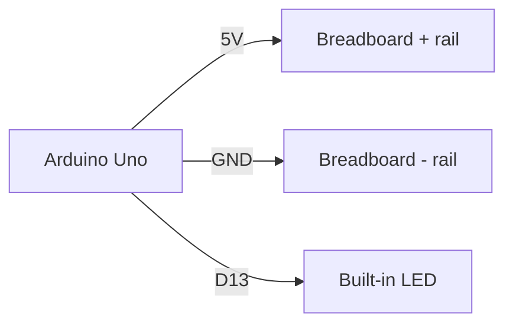
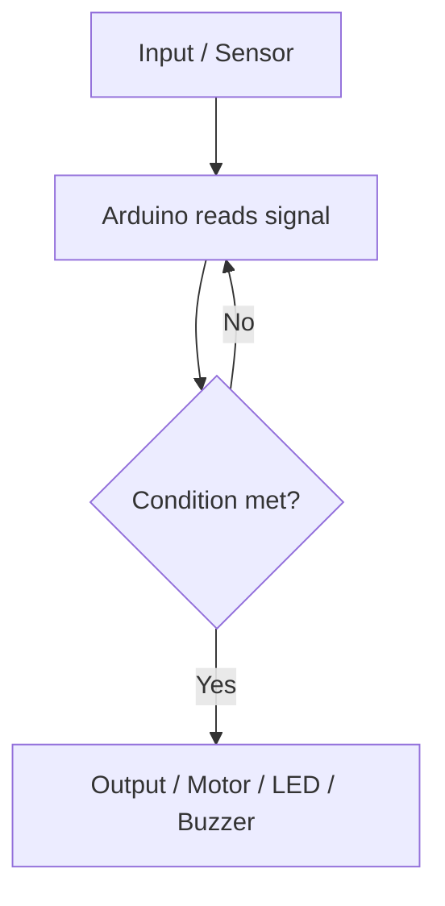

# Electronics Connections

Use this document to describe the circuit, pin mapping, and wiring plan for the project.

## Components

| Component | Pin / Terminal | Connected To | Notes |
| --- | --- | --- | --- |
| Arduino Uno | 5V | Breadboard positive rail | Power |
| Arduino Uno | GND | Breadboard negative rail | Ground |
| Built-in LED | D13 | Arduino D13 | Starter test output |

## Mermaid Wiring Diagram

## Signal Flow

## Notes

- Keep all grounds connected together.
- Add resistors for LEDs unless using a built-in LED or protected module.
- Test each component separately before combining the full circuit.
- Update this file whenever wiring changes.

