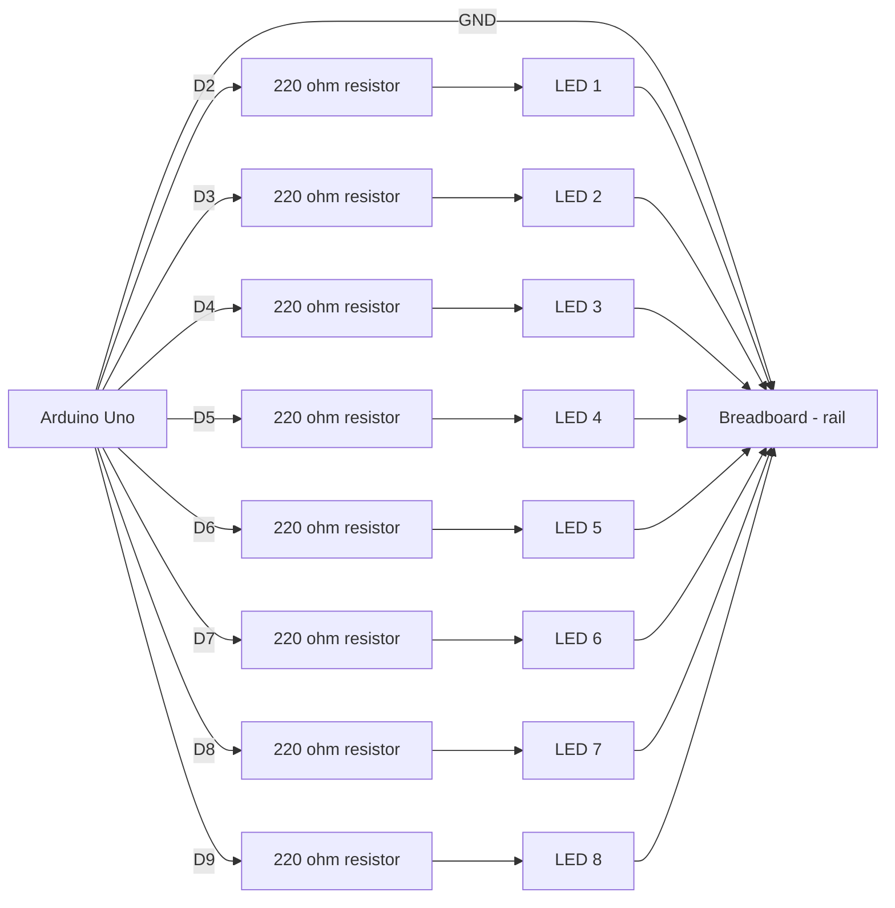
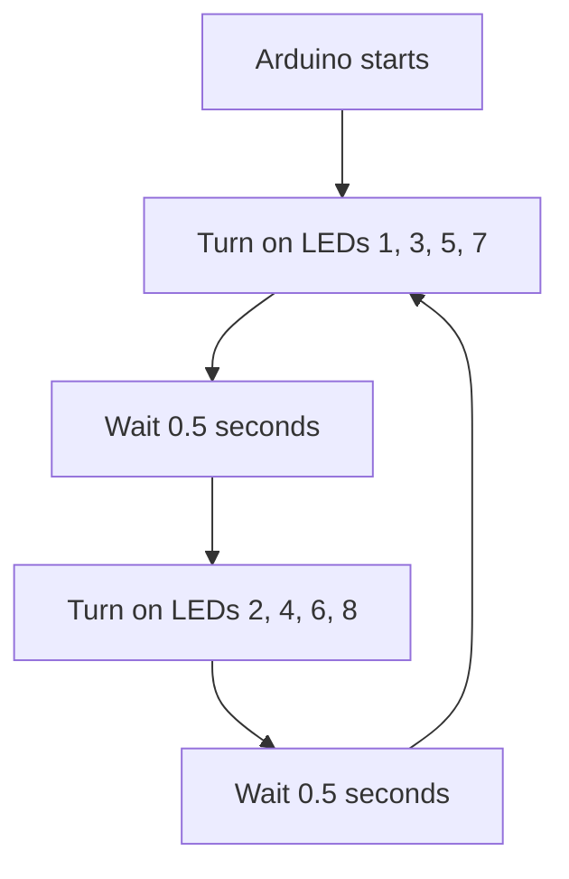

# Electronics Connections

Wiring guide for the Alternating Eight LEDs activity.

## Components

| Component | Pin / Terminal | Connected To | Notes |
| --- | --- | --- | --- |
| Arduino Uno | GND | Breadboard negative rail | Common ground |
| LED 1 | Anode (+) | Arduino D2 through 220 ohm resistor | Odd group |
| LED 1 | Cathode (-) | Breadboard negative rail | Ground |
| LED 2 | Anode (+) | Arduino D3 through 220 ohm resistor | Even group |
| LED 2 | Cathode (-) | Breadboard negative rail | Ground |
| LED 3 | Anode (+) | Arduino D4 through 220 ohm resistor | Odd group |
| LED 3 | Cathode (-) | Breadboard negative rail | Ground |
| LED 4 | Anode (+) | Arduino D5 through 220 ohm resistor | Even group |
| LED 4 | Cathode (-) | Breadboard negative rail | Ground |
| LED 5 | Anode (+) | Arduino D6 through 220 ohm resistor | Odd group |
| LED 5 | Cathode (-) | Breadboard negative rail | Ground |
| LED 6 | Anode (+) | Arduino D7 through 220 ohm resistor | Even group |
| LED 6 | Cathode (-) | Breadboard negative rail | Ground |
| LED 7 | Anode (+) | Arduino D8 through 220 ohm resistor | Odd group |
| LED 7 | Cathode (-) | Breadboard negative rail | Ground |
| LED 8 | Anode (+) | Arduino D9 through 220 ohm resistor | Even group |
| LED 8 | Cathode (-) | Breadboard negative rail | Ground |

## Pin Assignment

| Arduino Pin | LED Number | Group |
| --- | --- | --- |
| D2 | LED 1 | Odd |
| D3 | LED 2 | Even |
| D4 | LED 3 | Odd |
| D5 | LED 4 | Even |
| D6 | LED 5 | Odd |
| D7 | LED 6 | Even |
| D8 | LED 7 | Odd |
| D9 | LED 8 | Even |
| GND | All LED cathodes | Common ground |

## Mermaid Wiring Diagram

## Signal Flow

## Notes

- Keep all grounds connected together.
- Use one 220 ohm resistor for each LED.
- The longer LED leg is the anode (+), and the shorter leg is the cathode (-).
- The sketch uses digital pins D2 to D9.
- Update this file whenever wiring changes.
